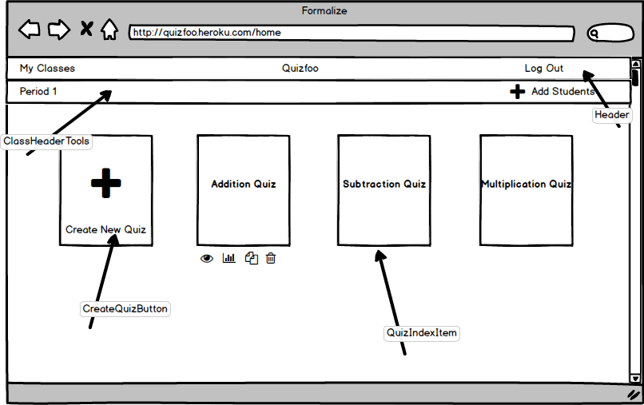
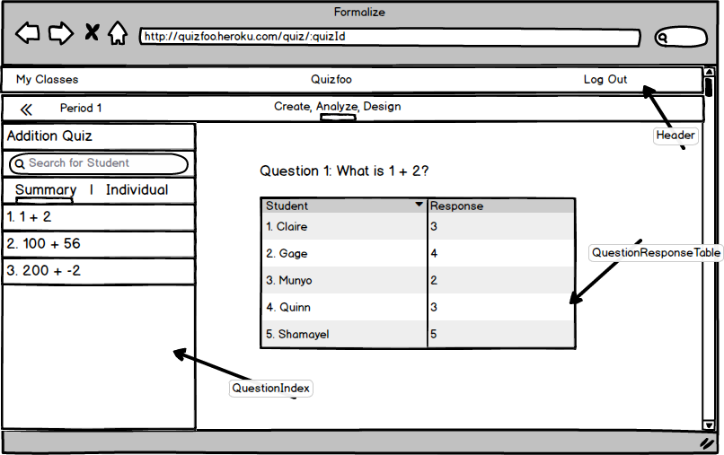

# Quizfoo

[Quizfoo live][heroku]

[heroku]: http://quizfoo.herokuapp.com

Quizfoo is a full-stack web application inspired by Wufoo, Typeform, and Google Forms. It uses Ruby on Rails on the backend, PostgreSQL for it's database, and React.js with a Redux architectural framework on the frontend. Much of the styling for the site uses Material UI.

## Features & Implementation

### Quizzes

  Quizzes are stored in the database as one table, and contain references to the `teacher_id`, and the `title` of the quiz. Using the `header_menu`, users are able to navigate through the site to see an index of quizzes created by all users, or view their own quizzes. These views are available through the `quiz_index` component and the `quiz_cards` component, respectively. The `quiz_index` component contains links that allow users to view and take quizzes that have been created by other users. From the `quiz_cards` component, users can choose to create, edit, or delete quizzes.

  

  Once a user has created a quiz, they are immediately routed to the `quiz_nav` component. A new navigation bar appears at the top of the view. This `quiz_nav` component contains three separate tabs to create, analyze, and preview the current quiz.

### Questions

  The create tab is where users can add and delete questions from their quiz. This tab contains the `question_cards` component which shows each question that belongs to the quiz. The questions are stored on a separate table in the database. Each question belongs_to a quiz using the `quiz_id`, and contains `text`, `order`, and a `form_type`. The `form_type` determines whether the question will be shortAnswer, paragraph, or multipleChoice.

### Results

  The `results` component renders two separate subcomponents. On the left, a `results_sidebar` shows a list of questions that are in the current quiz. On the right, the `results-table` is rendered. When a question in the `results_sidebar` is clicked, the user is shown a table of students and responses for that specific question.  

  

## Future Directions for Quizfoo

  Quizfoo was created with teachers in mind. Currently, there are some key features missing from the app that would be very beneficial to the teachers who use it.

### Classes

  The ability to organize by class is crucial. Teachers may be teaching several different classes at once, and creating a way to organize the quizzes for those classes would make their lives much easier. Quizzes could also be copied between classes. In addition. they could also search for quizzes that other teachers have made based on the class title.

  

### Students

  Users are required sign up with an email address. In addition to ensuring uniqueness, this feature was created with the future in mind. Students would be able to join classes and teachers would be able to email quizzes to their students. Unlike teachers, students would not be able to create quizzes, but they would be able to view their responses to quizzes that they have taken.

### Parents

  Parents would be linked to students and be able to see the students' results for each quiz. They would also be able to see upcoming quizzes that the teacher has posted but has not yet made available.

### Results

  While the teachers can view results for individual questions, they are not yet able to see an analysis of those results. In the future, the `results` component of the app should show graphs the results of the quiz. That way, teachers can easily analyze trends and common misconceptions. In addition, there should be a sidebar that lists each student, and corresponding tables for that specific student's responses to each question of the quiz.
